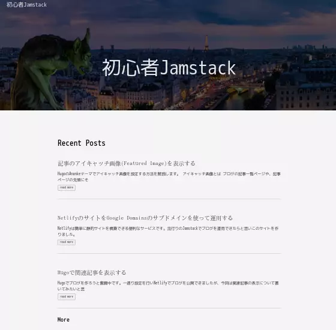
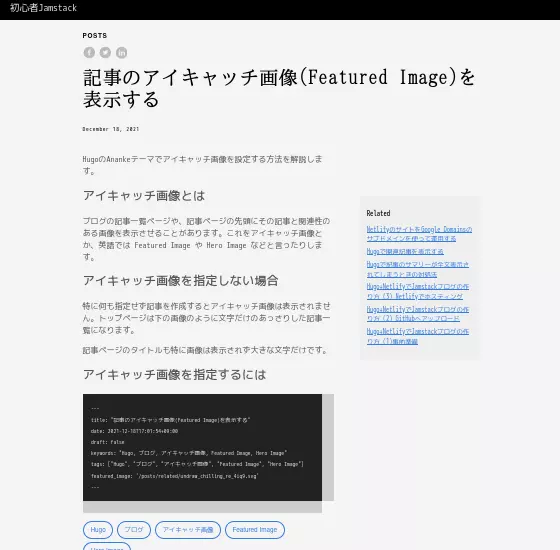
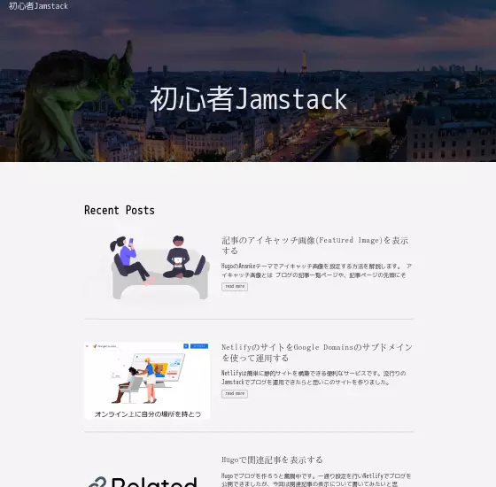
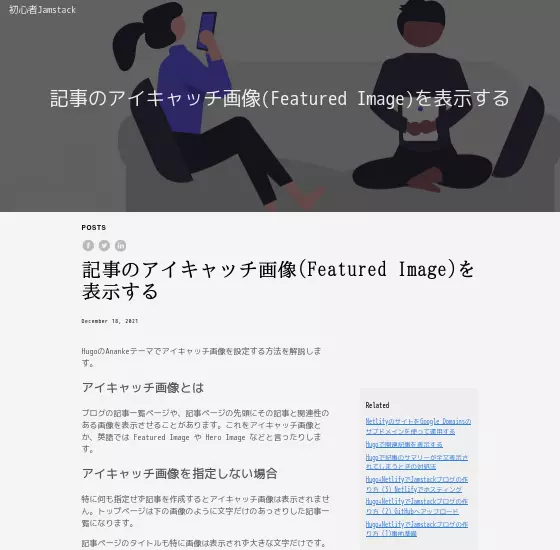

HugoのAnankeテーマでアイキャッチ画像を設定する方法を解説します。

## アイキャッチ画像とは

ブログの記事一覧ページや、記事ページの先頭にその記事と関連性のある画像を表示させることがあります。これをアイキャッチ画像とか、英語では Featured Image や Hero Image などと言ったりします。

## アイキャッチ画像を指定しない場合

特に何も指定せず記事を作成するとアイキャッチ画像は表示されません。トップページは下の画像のように文字だけのあっさりした記事一覧になります。



記事ページのタイトルも特に画像は表示されず大きな文字だけです。



## アイキャッチ画像を指定するには

記事の Front Matter に featured_image というアイテムを追加し、画像へのリンクを指定します。リンクに相対パスを指定する('./featured_image.png'など)と表示されませんでした。なので、content フォルダからのパス(Hugo内の絶対パスというか、何というのでしょうね)で'/posts/.../featured_image.png'のように指定しています。

```
---
title: "記事のアイキャッチ画像(Featured Image)を表示する"
date: 2021-12-18T17:01:54+09:00
draft: false
keywords: "Hugo, ブログ, アイキャッチ画像, Featured Image, Hero Image"
tags: ["Hugo", "ブログ", "アイキャッチ画像", "Featured Image", "Hero Image"]
featured_image: '/posts/related/undraw_chilling_re_4iq9.svg'
---
```

トップページにアイキャッチ画像が表示されました。



記事ページにはタイトルの背景としてアイキャッチ画像が表示されます。



画像の上にタイトル文字が重なって表示されますが、Front Matter で omit_header_text: true とすると、タイトル文字を消して画像だけが表示されます。

## まとめ

HugoのAnankeテーマを使用している場合、Front Matterでfeatured_imageを指定することでアイキャッチ画像を表示することができます。記事ページのアイキャッチ画像は少し大きすぎ、暗くなるので今後カスタマイズしていきたいと思います。

