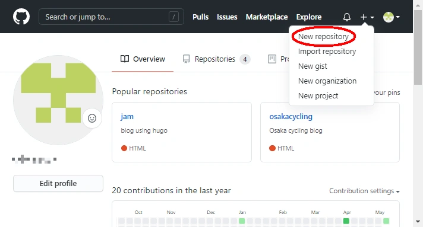
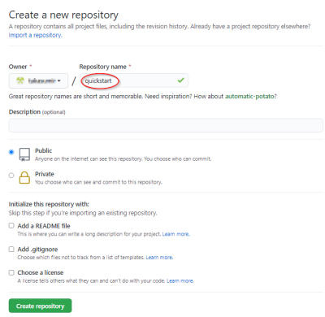
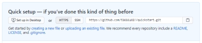
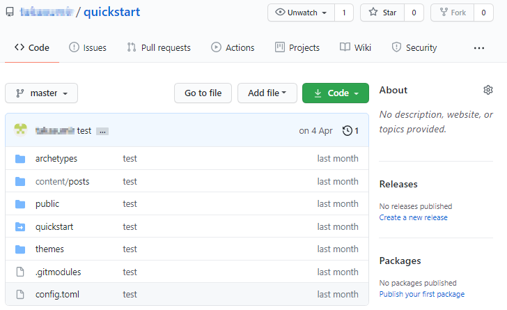

[Hugo+NetlifyでJamstackブログの作り方 (1)事前準備](/posts/quick-start/)でHugoでドラフト記事を作成し、ローカルサーバーで表示してみました。次はGitHubへのアップロードです。

## GitHubのアカウント登録

GitHubのアカウントを持っていない場合は、[GitHub](https://github.com/)へアクセスして右上のボタンからSign upします。


## レポジトリの作成

アカウントを登録したら右上の＋マークからNew Repositoryで新しいレポジトリを作成します。



quickstartという名前を入れてレポジトリを作成します。



レポジトリが作成できました。



レポジトリのURL `https://github.com/ユーザー名/quickstart.git` は後で使うのでコピーしておきましょう。

## GitHubへアップロード

Git bashを起動し、quickstartフォルダで下記コマンドを実行しローカルレポジトリにファイルを追加(add)します。

```sh
$ git add .
```

ファイルを追加したら次はコミット(commit)します。

```sh
$ git commit -m 'my first commit'
```

ローカルレポジトリからファイルをプッシュ(push)する先のリモートレポジトリを設定します。リモートレポジトリは先ほどGitHubで作成したURLを入れます。

```sh
$ git remote add origin https://github.com/ユーザー名/quickstart.git
```

リモートレポジトリが正しく追加されたか確認します。

```sh
$ git remote -v
```

最後にリモートレポジトリにローカルファイルをプッシュ(push)します。origin、masterなどbranchの概念が出てきますがここではとりあえずmasterブランチにアップロードします。別のbranch名を作成してNetlifyでbranchを指定することもできます。

```sh
$ git push origin master
```

ファイルがアップロードされました。



## まとめ

Hugoで記事を作成した後のGitHubへのアップロードについて説明しました。gitのコマンドは慣れないと難しく感じますが、ローカルレポジトリを変更したら add -> commit -> push の流れを掴んでおけば良いでしょう。

次はようやくGitHubへアップロードしたファイルをもとにNetlifyでブログを公開する方法を説明します。
