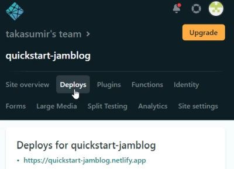

Hugoでブログ記事を作成しGitHubへアップロードしました。最後にNetlifyでブログをホスティングします。

## 記事をドラフト(draft)から正式版にする

[Hugo+NetlifyでJamstackブログの作り方 (1)事前準備](../quick-start/)で記事を作成しましたが、`quick-start.md`の最初の数行、ヘッダー行(fromt matter というみたいです)に`draft: true`と書かれた行があります。`true`だとドラフト状態なのでHugoで-Dオプションを付けないとHTMLファイルが作成されません。この行を`draft: false`に変更します。

```markdown
---
title: "Hugo+NetlifyでJamstackブログの作り方 (1)事前準備"
date: 2021-05-04T20:09:18+09:00
draft: false
---


今までGoogleのサービス、Bloggerでブログを書いていましたがカスタマイズ...
```

これで準備完了です。これで-Dオプションを付けなくても記事が作成されるようになります。

## Netlifyの登録

[Netlify](https://www.netlify.com/)へアクセスし、Get started for free ボタンをクリックします。


GitHubアカウントでサインインします。


サインインするとNetlifyにアクセス権を与える確認画面が出るので承認します。


ここからNetlifyのセットアップが続きます。


7ページもありましたが、入力後 Set up and continue ボタンを押して続けます。


## サイトを作成(deploy)する

始めのページ Team overview または Sites タブに New site from Git ボタンがあるのでこれをクリックします。


Gitプロバイダーとして、GitHubを選択します。


GitHubのレポジトリが出てくるので、先に作成していた quickstart レポジトリを選択します。


レポジトリの設定です。

* Branchは、git push した branch を指定します。前回記事ではデフォルトの master でした。
* Build command は hugo を入力。
* Publish directory は public を入力。


Advanced build settings の設定も必要でした。

* HUGO\_VERSION にローカルPCにインストールしたhugoのバージョンを入力。
* HUGO\_ENV に production を入力。


hugoのバージョンはPowershellかGit shellで下記コマンドで確認できます。

```shell
$ hugo version
hugo v0.82.0-9D960784 windows/amd64 BuildDate=2021-03-21T17:28:04Z VendorInfo=gohugoio
```

HUGO\_ENVにproductionを指定しないと作成した記事のmetaタグにNOINDEX, NOFOLLOWとなりサーチエンジンに見つけてもらえなくなってしまいます。これはanankeテーマに固有の設定かもしれません。下記はHUGO\_ENVを指定しなかった場合記事のヘッダーの例です。

```html
<META NAME="ROBOTS" CONTENT="NOINDEX, NOFOLLOW">
```

最後にDeploy siteをクリックします。Netlifyでは、サイトを作成することをDeploy(展開する、配置する)と呼ぶみたいです。


サイトが作成されました。サイト名は適当な名前が割り当てられています。https://jolly-shannon-ade428.netlify.app なぜこの名前？


ページ下に進むと Production deploys の項目があり、しばらくすると Published になればdeploy成功です！もしエラーが出ていたらこれまでの設定が何か間違っているはずです。ログを確認してみましょう。


## サブドメインを変更する

このあと、有料のドメインを購入すれば独自ドメインでサイトが運用できます。無料で使う場合には、サブドメインを変更することができます。

サイト名の下にSite settingsボタンがあるのでクリックします。


Change site nameをクリックするとサブドメイン部分(画像のjolly-shannon-ade428)を変更できます。


https://(変更したサイト名).netlify.app にアクセスしてみましょう。無事表示されました！


## config.tomlのサイト名を変更する

ここまできたらあと一歩です。上で表示したサイトは、hugo側にサイト名を反映させていないのでリンクが正しくなっていません。例えば記事のread moreボタンを押してみると下記のように記事に飛べない状態です。


`quickstart`フォルダ直下の設定ファイル、`config.toml`を編集します。下記は変更前です。

```
baseURL = "http://example.org/"
languageCode = "ja-jp"
title = "My New Hugo Site"
theme = "ananke"
```

`baseURL`をnetlifyのサイト名に変更します。titleにはサイト名を入れます。

```
baseURL = "https://quickstart-jamblog.netlify.app"
languageCode = "ja-jp"
title = "しろうとががんばってjamstackするサイト"
theme = "ananke"
```

`config.toml`を編集後、再度hugoで更新、git pushまで行い変更を反映します。下記の記事を参考ください。

* [Hugo+NetlifyでJamstackブログの作り方 (1)事前準備](../quick-start/)
* [Hugo+NetlifyでJamstackブログの作り方 (2) GitHubへアップロード](../quick-start-2)

変更をGitHubへアップロードできたらNetlifyのDeploysタブからTrigger deployをクリックして再度deployします。




再度サイトを表示します。タイトルが変更されているのが確認できます。記事のread moreをクリックすると、、、


ちゃんと記事へリンクできています。


## まとめ

初心者がJamstackで静的サイトのブログを作るまで一連の流れを説明しました。感想はどうでしたか？自分でやってみた感想としては、Bloggerとかのブログサービスに比べると相当な気力が必要でした。

こんなに大変な思いをしなく一発でブログが作れるブログサービスでよくね？ともなるのですが最大のメリットはSEO対策だと思います。今年5月よりGoogleが検索結果の順位にCore Web Vitalという指標を導入し、レスポンスの遅いサイト、CLSの点数が悪いサイトは検索順位を落とされてしまう可能性があります。

Hugo+GitHub+Netlifyで作ったこのサイトの記事は、測定ツールであるLighthouseを使うとなんとすべて100点です！BloggerだとまずPerformanceが30～40点台だし他の項目も軒並み低い点数です。


無料でこれだけパフォーマンスが良く、SEO対策も完璧なブログを作るにはやはり静的サイトと良いテンプレートが必要になるのでしょう。Netlifyが普及するとレスポンスが重くなりそうですけどね。

ということで、このブログでJamstackサイトの設定、調整、tipsなどをこれから発信していきたいと思います。
