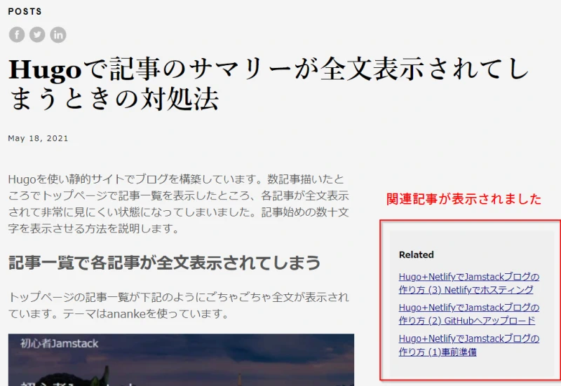

Hugoでブログを作ろうと奮闘中です。一通り設定を行いNetlifyでブログを公開できましたが、今回は関連記事の表示について書いてみたいと思います。テーマはanankeを使っています。

## 記事のFront Matterでkeywordsを指定する

とりあえず、手っ取り早く関連記事を表示するには、例えば次のように記事のFront Matterにkeywordsを入れます。

```
---
title: "Hugoで関連記事を表示する"
date: 2021-05-22T13:46:17+09:00
draft: false
keywords: "Hugo, ブログ, 関連記事, Related"
---
```

テーマがanankeの場合、これだけでキーワードがマッチする関連記事を表示してくれます。



## 関連記事の動作詳細を設定する

`config.toml`に下記項目を加えることで関連記事のカスタマイズができます。何も指定しないとデフォルト値は下のサンプルの通りになるみたいです。注意点として、１項目でも変更したい場合は`config.toml`でデフォルト値も全部書き加えないといけないということです。

```
[related]
  includeNewer = false
  threshold = 80
  toLower = false

  [[related.indices]]
    name = "keywords"
    weight = 100

  [[related.indices]]
    name = "date"
    weight = 10
```

デフォルトでは表示している記事より新しい記事は含まれない設定なので、`includeNewer = true`と変更して日付の新しい記事も関連記事に出るようにしました。その他はこのまま使っています。

## 関連記事の表示をカスタマイズする

デフォルトで関連記事が出てこないテーマを使用している場合や、自分で表示場所を指定したい場合はテンプレートで`.Site.RegularPages.Related`を使います。

`layouts/partials/related.html`を作成して中身を下記の通り記述して保存します。

```html
{{ $related := .Site.RegularPages.Related . | first 5 }}
{{ with $related }}
<h3>関連記事</h3>
<ul>
	{{ range . }}
	<li><a href="{{ .RelPermalink }}">{{ .Title }}</a></li>
	{{ end }}
</ul>
{{ end }}
```

この`related.html`を`single.html`で読み込みます。`themes/ananke/layouts/_default/single.html`を直接編集するか、これを`layouts/_default/single.html`にコピーして下記を追記します。

```
{{- partial "related.html" . -}}
```

## 失敗談と注意点

Front Matterに`keywords`の **s** を忘れて`keyword`としてしまうと何も表示されません。

また、` . `の記述忘れにも注意です。
```
{{- partial "related.html" ※ここのドット( . )の記述忘れ -}}
```
