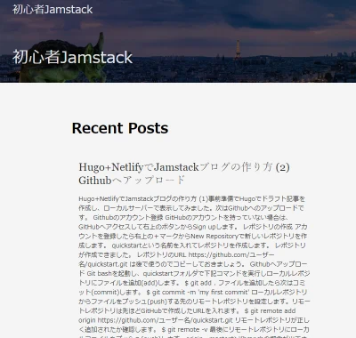
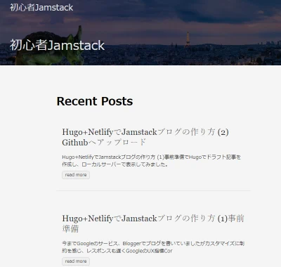

Hugoを使い静的サイトでブログを構築しています。数記事描いたところでトップページで記事一覧を表示したところ、各記事が全文表示されて非常に見にくい状態になってしまいました。記事始めの数十文字を表示させる方法を説明します。

## 記事一覧で各記事が全文表示されてしまう

トップページの記事一覧が下記のようにごちゃごちゃ全文が表示されています。テーマはanankeを使っています。



これでは記事一覧の意味がありませんね。

## 全文表示されてしまう原因

Hugoでは、記事のサマリーは.Summaryという記事パラメータに格納されます。サマリーを指定する方法は3通りあります。

* 自動でsummaryLengthで指定した記事の始めの文字数がサマリーになる。
* 手動で記事内に\<!--more--\>を入れるとその前までがサマリーとなる。
* Front matter で sammary 変数にサマリー文字列を指定する。

簡単なのが一番始めの自動でサマリーを作ってくれる方法で、何も指定しないと標準でこの方法になるはずなのですが、実は日本語（中国語、韓国語も）ではこの機能が働きません。

## 対処方法

サイト全体の設定ファイルで hasCJKLanguage を true に指定すると自動でサマリーを作ってくれるようになります。`config.toml`に下記１文を追加します。

```
hasCJKLanguage = true
```

サイトを構築して表示させてみます。



記事一覧がスッキリしました！
