Netlifyは簡単に静的サイトを構築できる便利なサービスです。流行りのJamstackでブログを運用できたらと思いこのサイトを作りました。

一通りHugo, Githubの設定をして記事を書けるようになりましたが、ドメインが "jamblog.netlify.app" です。これはこれでシンプルなので悪くないと思っていましたがやはり独自ドメインで運用したいもの。

Netlifyでドメインを取得すれば何も考えなくても独自ドメインで運用できます。しかしながら既にGoogleのブログサービス、Bloggerで別のブログをやっていて独自ドメインもGoogle Domains取得しています。独自ドメインはお金がかかるので、できれば今持っているドメインで運用したいと考えました。

そこで、今のBloggerでのブログは活かしたまま、サブドメインを作り、Netlifyで運用しているこのブログに割り当てましたのでやり方をご紹介します。

## Google Domainsでサブドメインを作る

既にGoogle Domainsで独自ドメインを持っていることを前提とします。まずはGoogle Domainsにログインします。

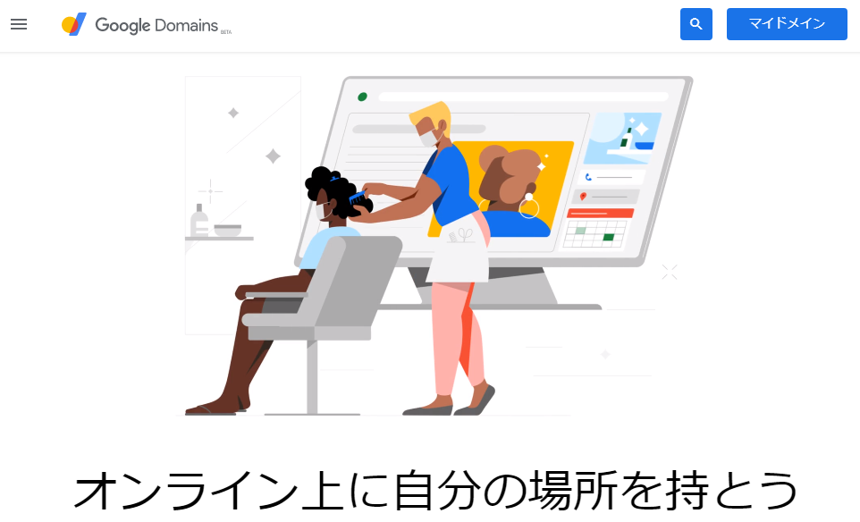

「ウェブサイト」にはBloggerのサイトがあります。もともとBloggerから独自ドメインを申し込んだ経緯からです。

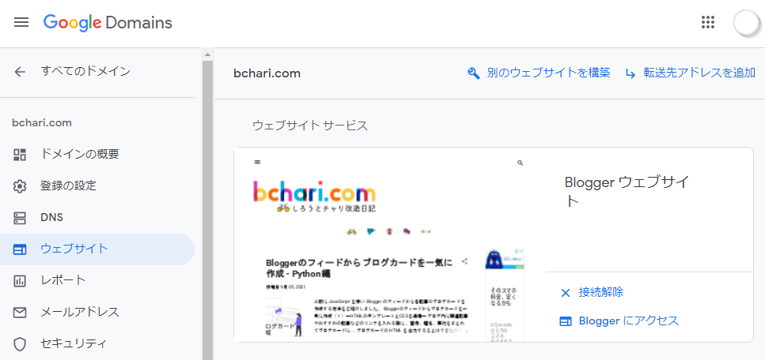

「DNS」のリソースレコードにカスタムレコードという項目があります。下の画像では既に1項目設定されていますが、初期設定では何も無い状態になります。その他メール転送、ブログホスティングの項目は、Bloggerで設定されたものが表示されていますが今回は関係ありません。

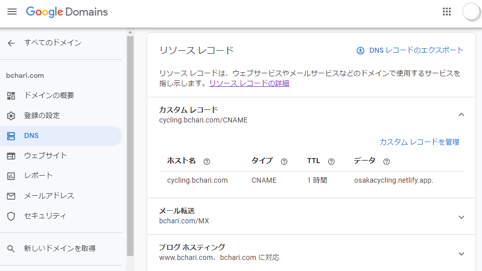

デフォルトのネームサーバーの、カスタムレコードの「新しいレコードを作成」をクリックしてホスト名に好きなサブドメイン名を、タイプに「CNAME」を、TTLは始めから3600が入っているのでそのままにし、データにNetlifyでのサイトの（サブドメイン含む）ドメイン名を入れて保存します。

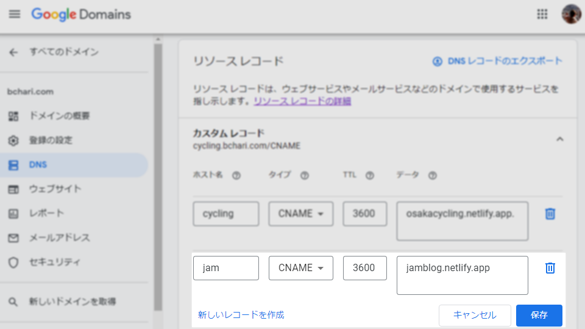

保存後、Netlifyのドメイン名の最後にピリオド「.」が着きますが、気にしなくて良いです。(jamblog.netlify.app**.** になっています）

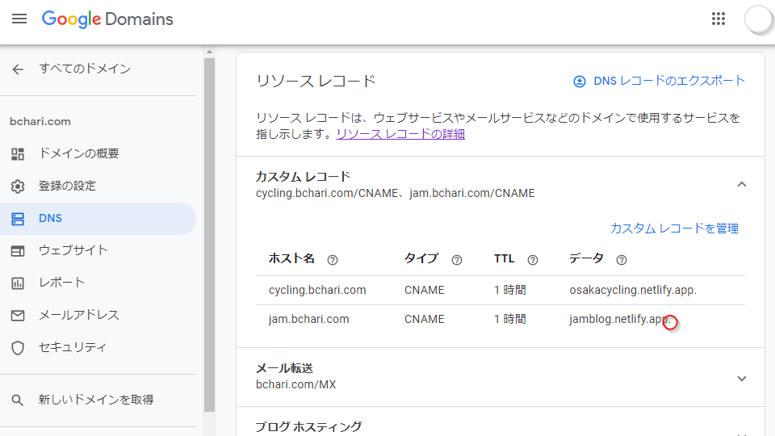

これでGoogle Domainsの設定は終わりです。

## Netlifyにサブドメインを設定

次に、Netlify側の設定をしましょう。NetlifyにログインしてサイトのDomain settingsをクリックします。

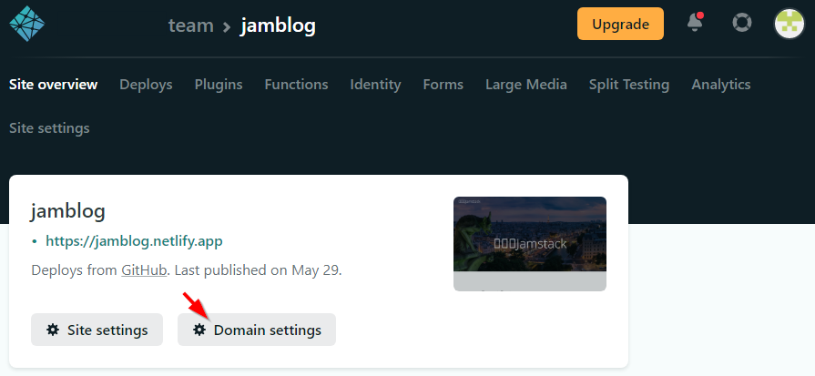

Custom domainsの項目にAdd custom domainボタンがあるのでクリックします。

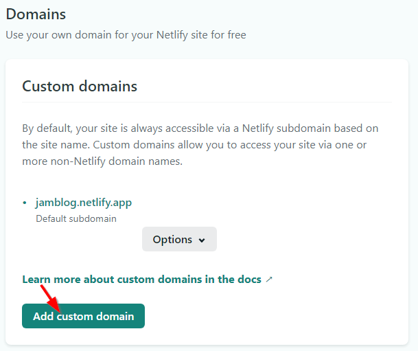

さきほどGoogle Domainsで作ったサブドメインを含むドメイン名を入れてVerifyをクリックします。この例ではjam.bchari.comです。

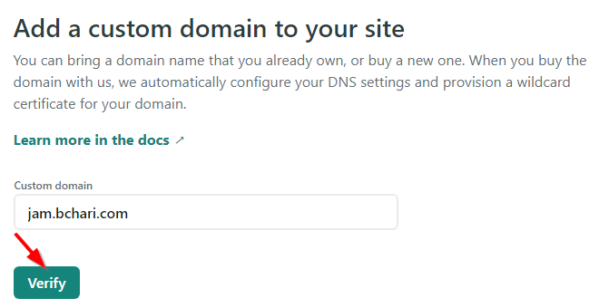

既にドメイン名が登録されているよ、と警告が出ます。もちろんGoogle Domainsで登録しているからなのでこのままAdd domainをクリックして進めます。

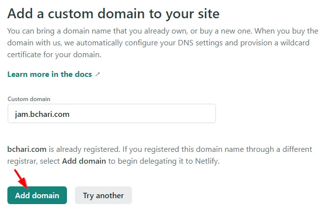

SSL/TSL certificateのVerify DNS configurationをクリック。

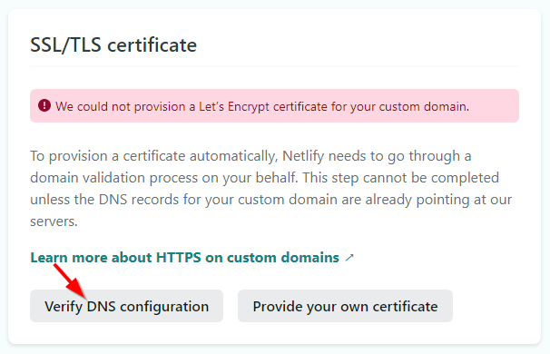

DNS verification was scccessfulと出ました。

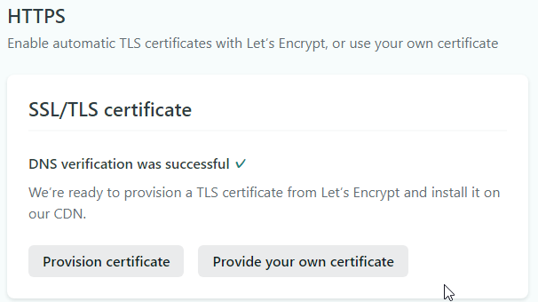

Custom domainsにも登録したjam.bchari.comがPrimary domainとして登録されています。

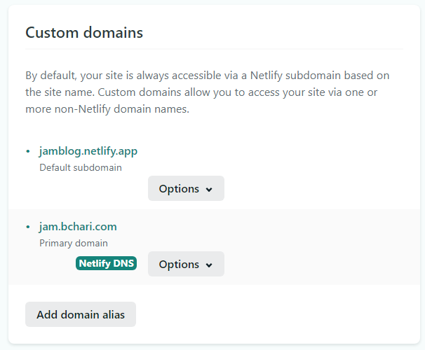

## Hugoのconfig.tomlの設定

Hugoのサイト設定ファイル、config.tomlのbaseURLの設定を変更します。変更前は、下記のようにnetlifyのドメインになっています。

```
baseURL = "https://jamblog.netlify.app/"
```

これを先程作ったjam.bchari.comに書き換えます。

```
baseURL = "https://jam.bchari.com/"
```

## ビルドして確認

config.tomlを書き換えたらローカルのHugoでサイトを作り確認後、gitへpushします。

$ hugo
$ git add -A
$ git commit -m "domain changed"
$ git push

さて、変更後のURL https://jam.bchari.com にアクセスすると、無事トップページが表示されました。各ページへのリンクも全て変更後のドメインに変わっています。

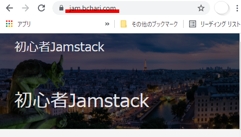

もちろん、今までのアドレス https://jamblog.netlify.app でもアクセスでいます。

## まとめ

Netlifyで運用しているサイトを、Google Domainsのサブドメインに割り当てることができました。ポイントはGoogle DomainsのネームサーバーでCNAMEを設定することです。

独自ドメインでブログなどをやっていて、Jamstackに興味のある方は今持っているドメインを使うことができるので気軽に試してみてはいかがでしょうか？

